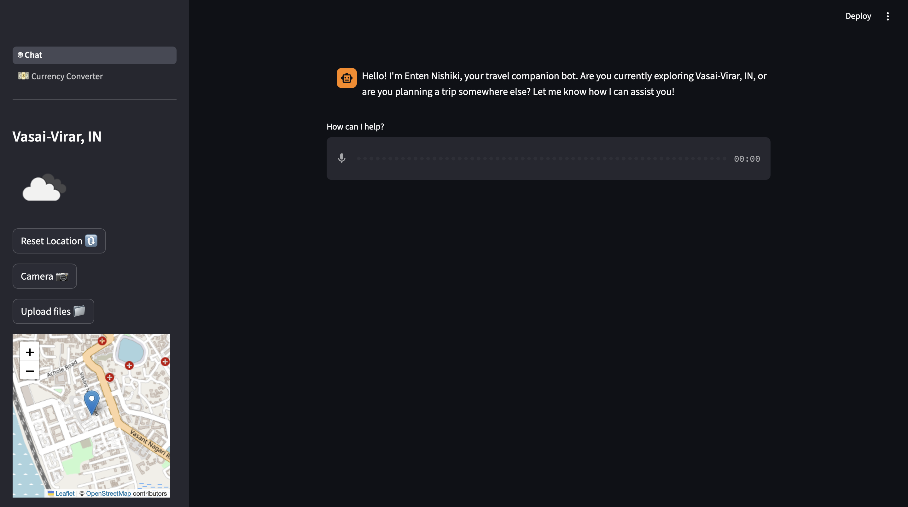
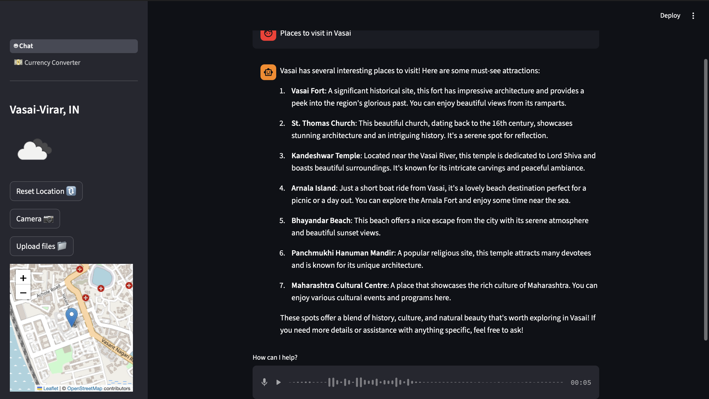
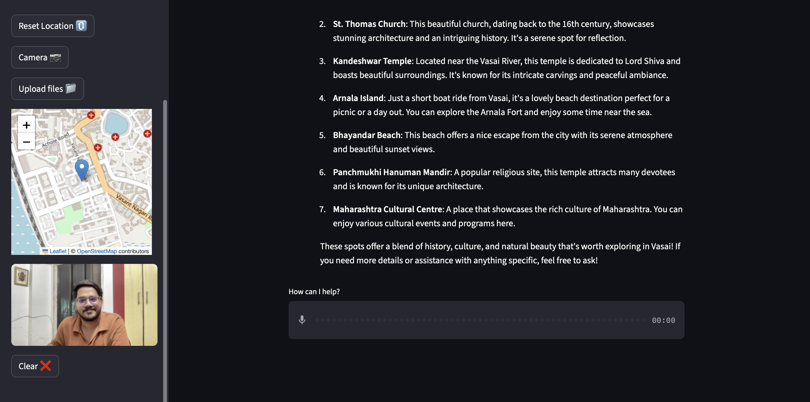
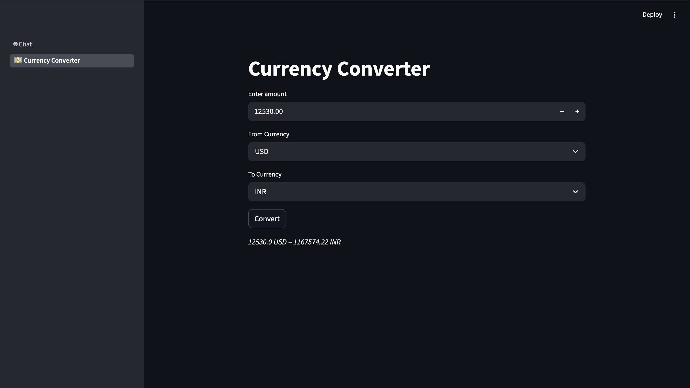

# AI-Powered Travel & Language Companion App 🌍🤖

## 👋 Introduction

This repository contains the **AI-Powered Travel & Language Companion App**, a Streamlit-based application designed to assist global travelers in overcoming language barriers and navigating new environments. By integrating Large Language Models (LLMs) with real-world utility tools like live weather and currency conversion, it provides an all-in-one digital companion for seamless travel.

## 🎯 Objective

The goal of this project is to provide travelers with a centralized, intelligent tool that simplifies communication and planning. It answers key needs such as:

* How do I translate complex phrases in real-time?
* What is the current weather and local advice for my destination?
* How much is my money worth in the local currency right now?
* Where can I find quick, reliable travel guides for major cities?

## 📸 Application Overview

### The Geospatial Element & UI

*The main interface featuring live location tracking (Folium) and open-source weather synchronization.*

### Interactive AI Chatbot & Translation

*RAG-powered AI providing structured travel recommendations, historical context, and translations.*

### Vision & Audio Capabilities

*Real-time camera integration allowing the AI to analyze visual context alongside audio transcriptions.*

### Travel Utilities

*A dedicated module for real-time currency conversion using live exchange APIs to manage budgets effectively.*

## 🛠️ Tools & Technologies Used

* **Interface & Deployment:** [Streamlit](https://streamlit.io/)
* **Artificial Intelligence:** OpenAI GPT-4o-mini / Whisper / TTS Integration
* **Programming Language:** Python (using JSON, Dictionaries, and Error Handling)
* **APIs:** OpenWeatherMap API, Currency Exchange APIs
* **Database:** ChromaDB (Vector Database)
* **Version Control:** Git & GitHub

## 📂 Project Structure

* **`Chat_bot.py`**: Logic for the AI conversation, mult-modal inputs, and translation engine.
* **`streamlit_app.py`**: The main interface and navigation hub.
* **`location_weather.py`**: Integration with weather services for live updates.
* **`Currency.py`**: Real-time currency conversion logic.
* **`pdfs/`**: A curated folder of destination-specific guides (e.g., Paris, Tokyo) for RAG embedding.

## ✨ Key Features & Functionality

* **⚙️ Robust Backend:** Developed using Python with a focus on clean code, utilizing Object-Oriented Programming (OOP) and structured data handling.
* **🧮 Smart Conversational AI:** Uses prompt engineering to act as a specialized travel guide rather than just a generic chatbot.
* **📊 Integrated Knowledge Base:** Includes a library of city-specific PDFs to provide grounded information for popular travel hubs.
* **🗺️ Geospatial Awareness:** Fetches and displays information based on the user's specific travel location.
* **🔢 Real-time Data Fetching:** Implements API calls to ensure weather and currency rates are accurate to the minute.
* **🎨 User-Centric Design:** A clean, sidebar-driven navigation layout built for ease of use on both desktop and mobile views.

## 🚀 Future Roadmap: Advanced RAG Integration

I am currently working on expanding the **Retrieval-Augmented Generation (RAG)** pipeline. This upgrade will allow the AI to move beyond general knowledge and "read" an even wider array of specific PDF guides stored in the repository to provide hyper-accurate, document-verified travel advice.

## 🏁 Conclusion

This project demonstrates the practical application of AI in solving real-world logistics and communication challenges. By combining LLM capabilities with essential travel tools, it creates a high-utility platform that empowers users to explore the world with confidence.

---
Developed by [Sidharth Singh](https://github.com/Cdharth-07)